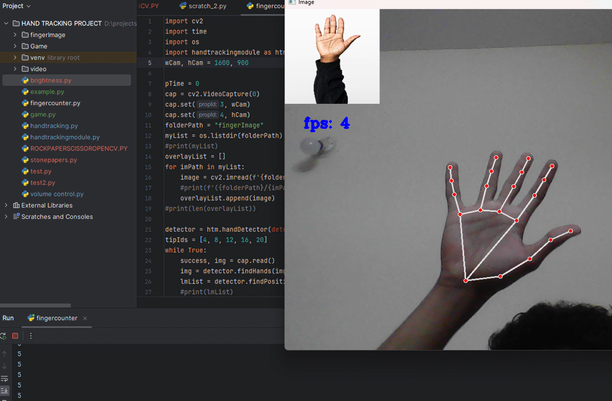

# Finger Counting with Computer Vision & Handtracking




This Python project utilizes hand tracking and overlay images to count the number of extended fingers in real-time using a webcam. It employs OpenCV and a custom hand tracking module to detect hand landmarks and determine the finger positions. Based on the number of extended fingers, the program overlays corresponding images onto the webcam feed.

### Features

- Real-time finger counting using a webcam.
- Hand tracking and landmark detection.
- Overlay images based on the number of extended fingers.
- Display FPS (Frames Per Second) on the webcam feed.

### Requirements

- Python 3.x
- OpenCV
- Hand tracking module (included)
- Webcam

### Usage

1. Clone the repository:

```bash
git clone https://github.com/your-username/finger-counting.git
cd finger-counting
```

2. Install the required dependencies:

```bash
pip install opencv-python
```

3. Run the main script:

```bash
python fingercounter.py
```

4. Use your webcam to interact with the program and see the finger counting in action.

### Customization

You can customize the overlay images in the `fingerImage` folder to change the visuals based on the number of extended fingers.

### Author

[vikasm7146@gmail.com]

### Acknowledgments

This project utilizes a custom hand tracking module developed by me . Special thanks to the creators of OpenCV for their contributions to computer vision and cvzone for the tutorial .

